# SAS2PY Architecture Diagrams

## 1. High-Level System Architecture

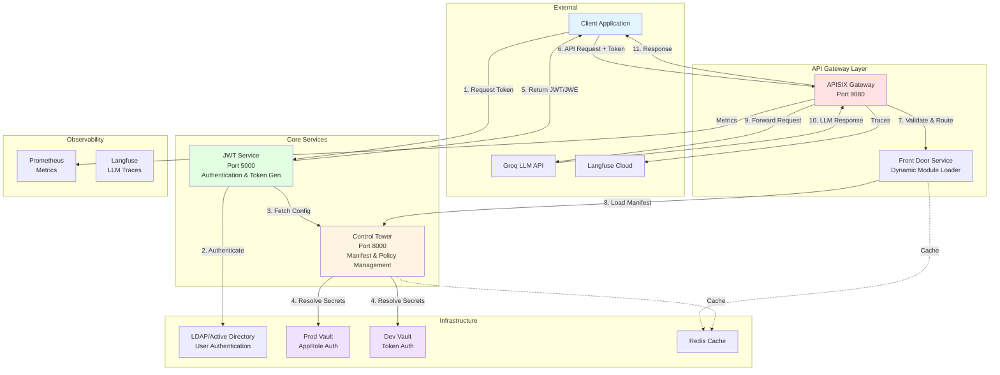

## 2. Authentication Flow - Standard JWT

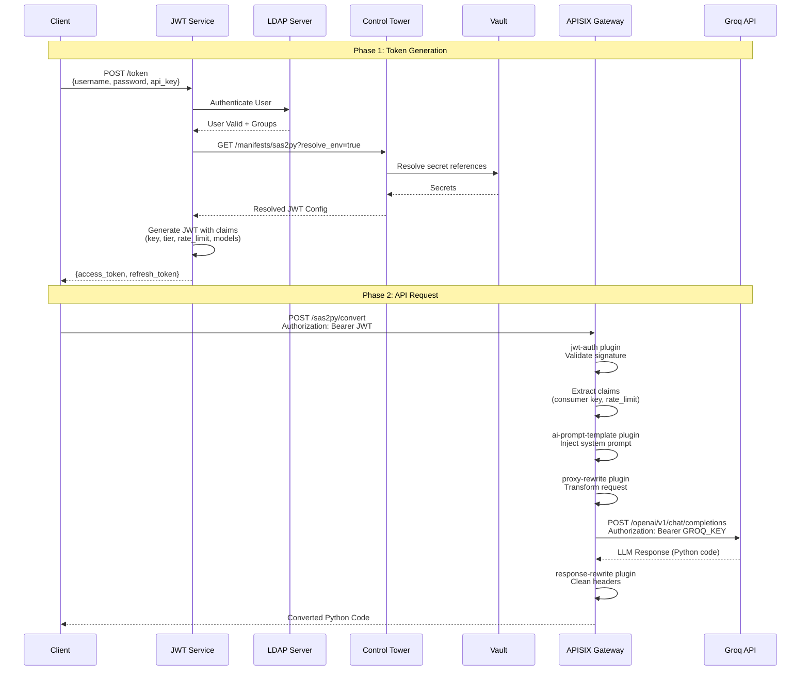

## 3. Authentication Flow - JWE Encrypted

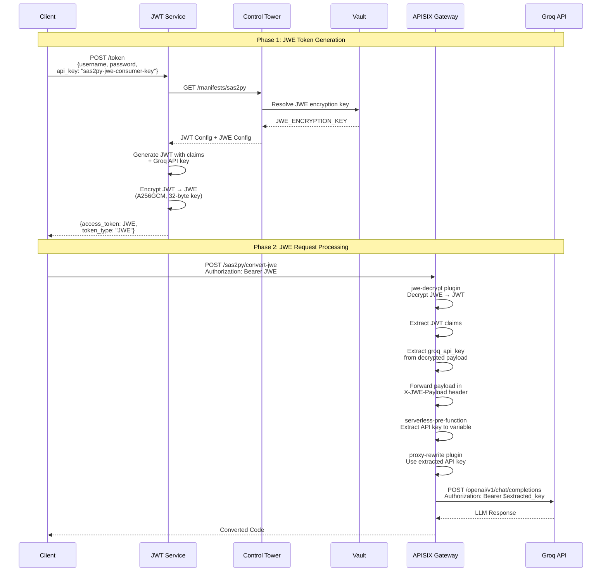

## 4. Multi-Vault Secret Resolution

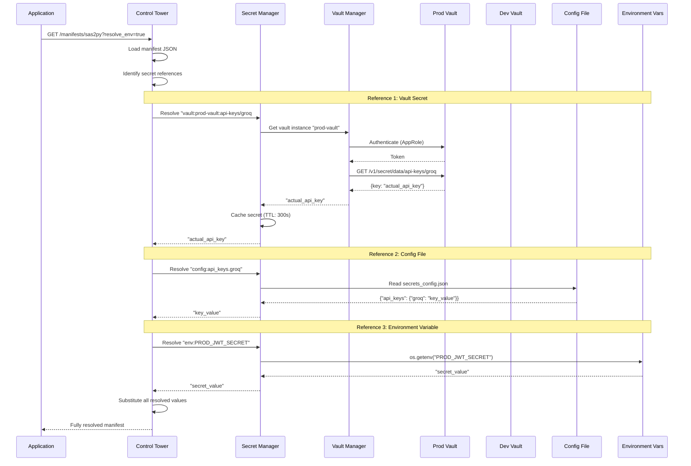

## 5. LDAP Integration Flow

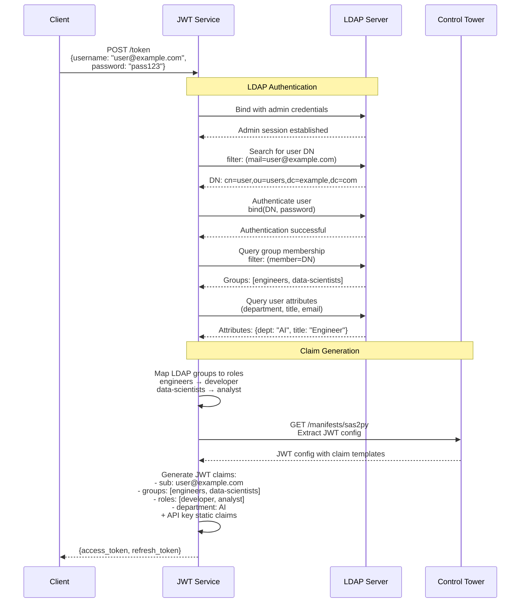

## 6. Multi-Environment Configuration

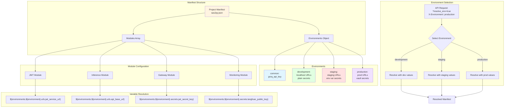

## 7. APISIX Plugin Processing Pipeline

```mermaid
graph LR
    subgraph "Request Flow"
        Client[Client Request] --> R1[Route Matching]
        R1 --> Auth{Authentication}
    end
    
    subgraph "Authentication Plugins"
        Auth -->|JWT| P1[jwt-auth plugin<br/>Validate signature<br/>Extract claims]
        Auth -->|JWE| P2[jwe-decrypt plugin<br/>Decrypt token<br/>Extract payload]
    end
    
    subgraph "Pre-Processing"
        P1 --> P3[request-id plugin<br/>Generate UUID<br/>X-Request-Id]
        P2 --> P3
        P3 --> P4[serverless-pre-function<br/>Custom Lua logic<br/>Extract variables]
    end
    
    subgraph "Transformation"
        P4 --> P5[ai-prompt-template<br/>Inject system prompt<br/>Transform user input]
        P5 --> P6[proxy-rewrite<br/>URI: /openai/v1/chat/completions<br/>Headers: Authorization]
    end
    
    subgraph "Observability"
        P6 --> P7[prometheus plugin<br/>Record metrics<br/>Latency, count]
        P7 --> P8[Langfuse integration<br/>Send trace data]
    end
    
    subgraph "Upstream"
        P8 --> U[Forward to Upstream<br/>Groq API]
        U --> Resp[LLM Response]
    end
    
    subgraph "Response Processing"
        Resp --> P9[response-rewrite<br/>Remove headers<br/>Content-Encoding]
        P9 --> P10[Add X-Request-Id<br/>to response]
        P10 --> ClientResp[Return to Client]
    end
    
    style P1 fill:#e1ffe1
    style P2 fill:#e1ffe1
    style P5 fill:#ffe1e1
    style P6 fill:#ffe1e1
    style P7 fill:#fff4e1
    style P8 fill:#fff4e1
```

## 8. Dynamic Claims Resolution

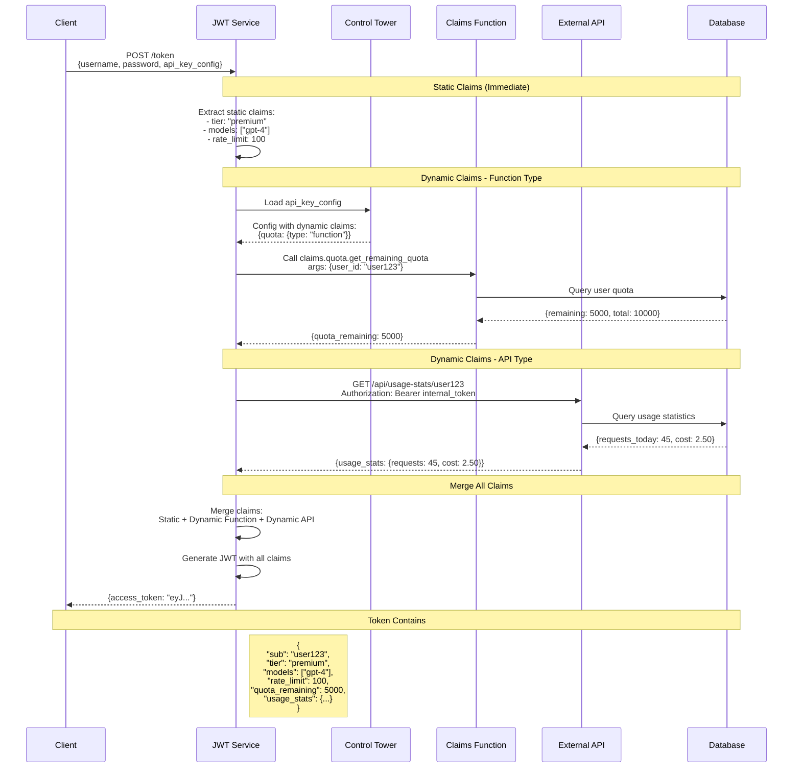

## 9. Complete End-to-End Request Flow

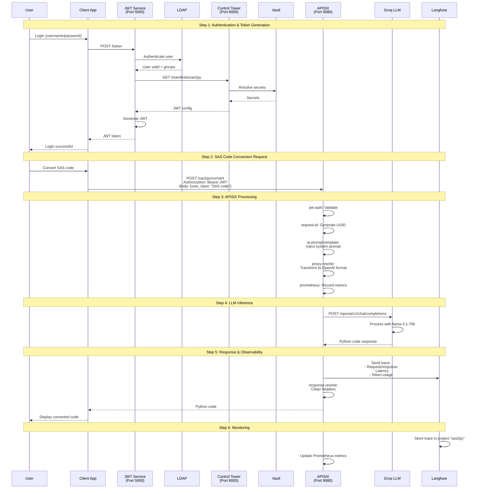

## 10. Module Dependency Graph

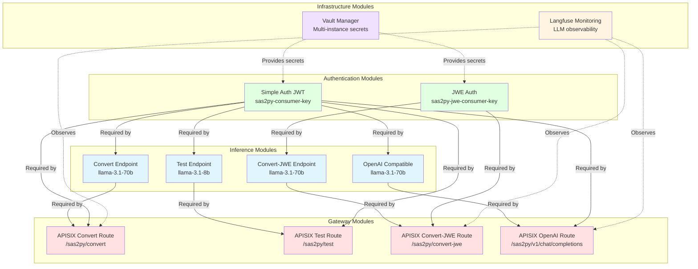

## 11. Secret Reference Resolution Patterns

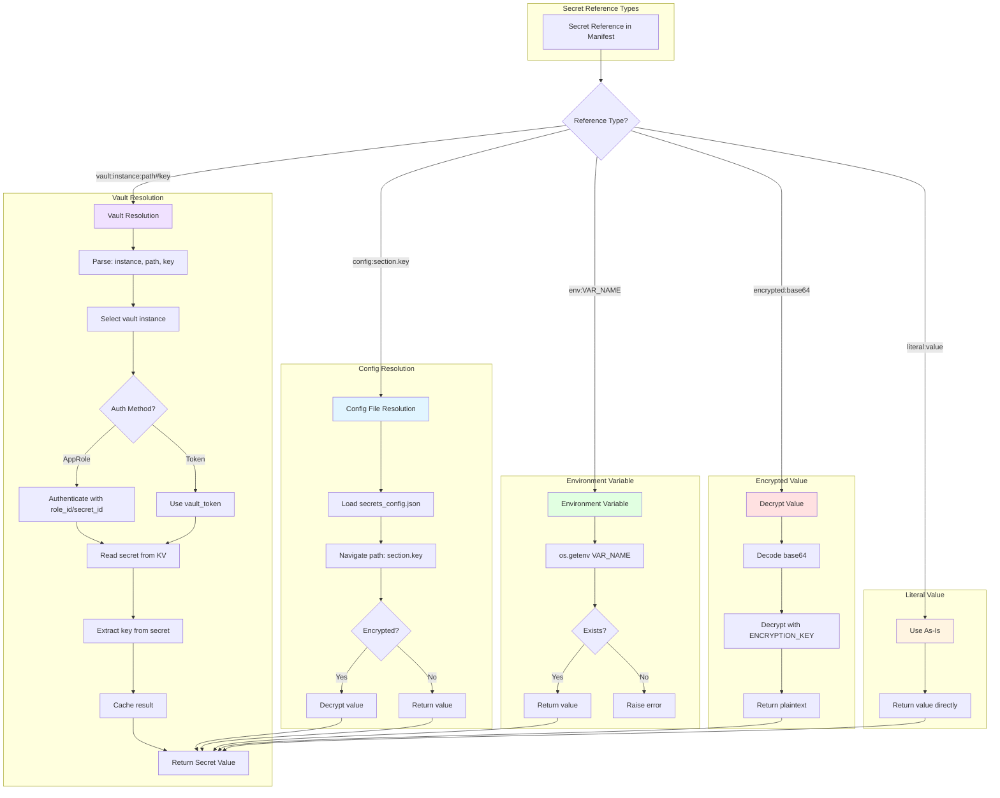

## 12. Rate Limiting & Claims Enforcement

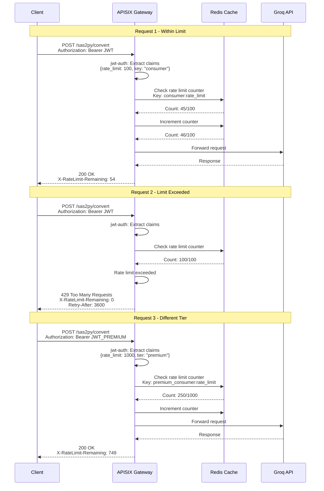

---

## Diagram Usage Guide

### For Architecture Diagram
Use **Diagram 1** to show:
- Overall system topology
- Service interactions
- Infrastructure dependencies
- Data flow paths

### For Sequence Diagrams
- **Diagram 2**: Standard JWT authentication flow
- **Diagram 3**: JWE encrypted token flow
- **Diagram 4**: Multi-vault secret resolution
- **Diagram 5**: LDAP integration details
- **Diagram 8**: Dynamic claims resolution
- **Diagram 9**: Complete end-to-end flow

### For Configuration Diagrams
- **Diagram 6**: Multi-environment setup
- **Diagram 7**: APISIX plugin pipeline
- **Diagram 10**: Module dependencies
- **Diagram 11**: Secret resolution patterns
- **Diagram 12**: Rate limiting enforcement

### Rendering Tools
These diagrams use **Mermaid** syntax and can be rendered in:
- GitHub/GitLab markdown
- VS Code (with Mermaid extension)
- draw.io (import Mermaid)
- Online: mermaid.live
- Documentation sites (MkDocs, Docusaurus)

### Customization
To modify diagrams:
1. Copy the Mermaid code block
2. Edit in mermaid.live for live preview
3. Adjust colors using `style` directives
4. Add/remove nodes as needed
5. Update sequence steps for your flow
